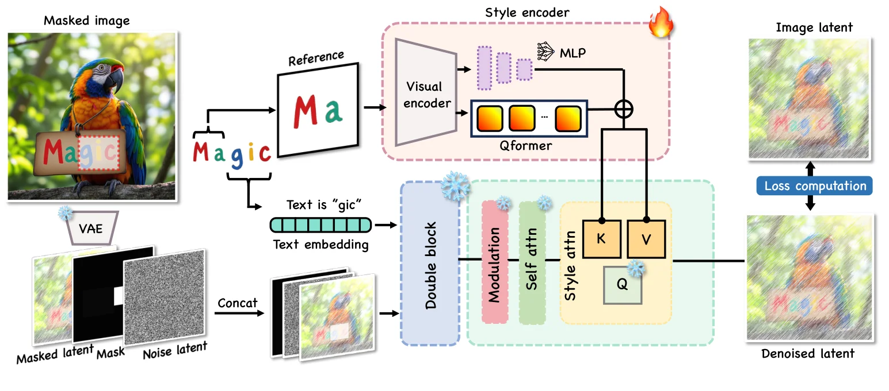
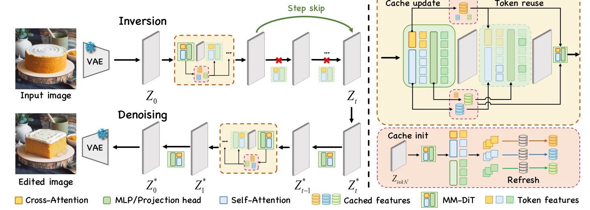
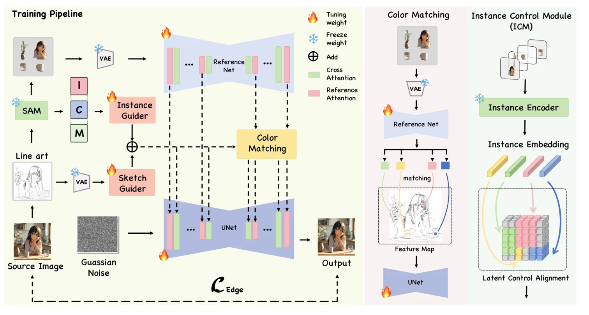
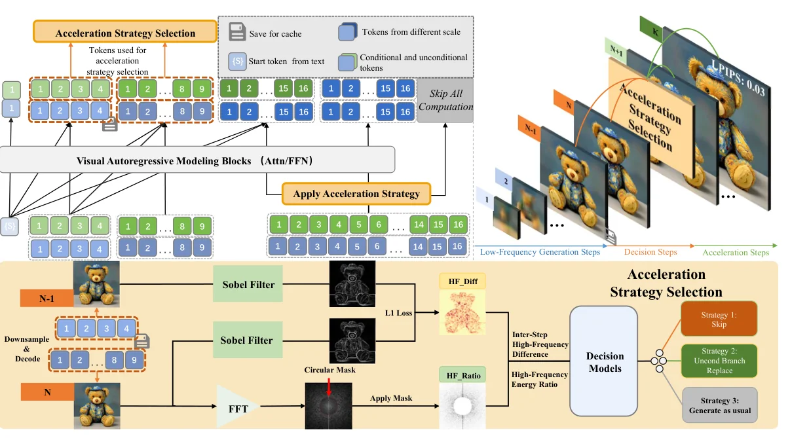
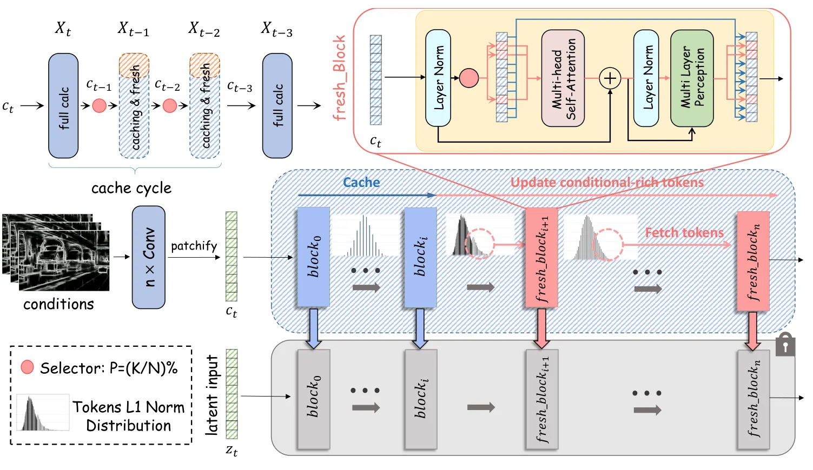
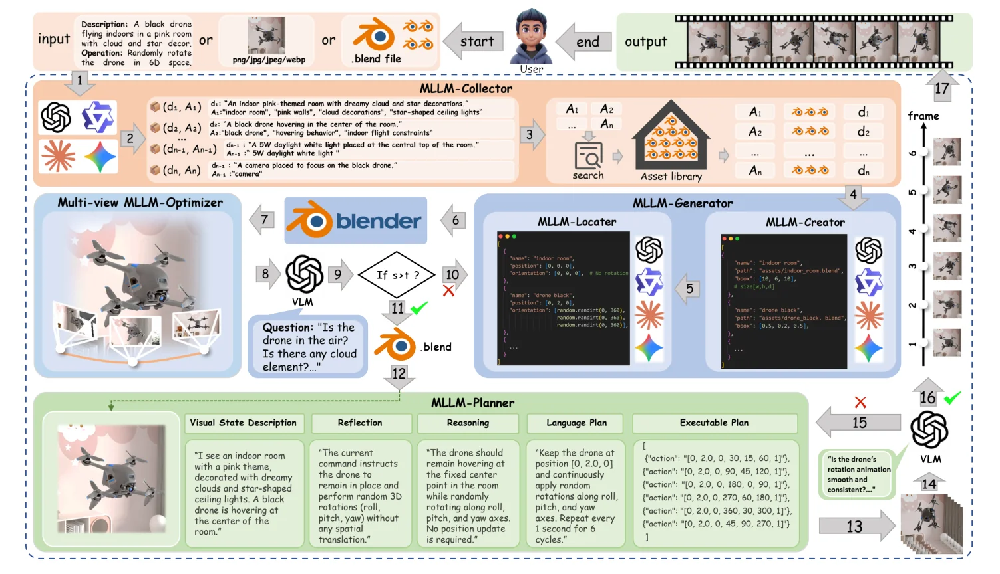
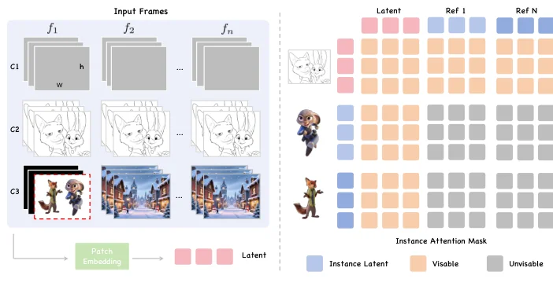
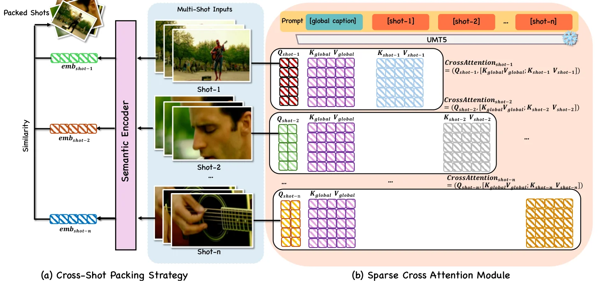
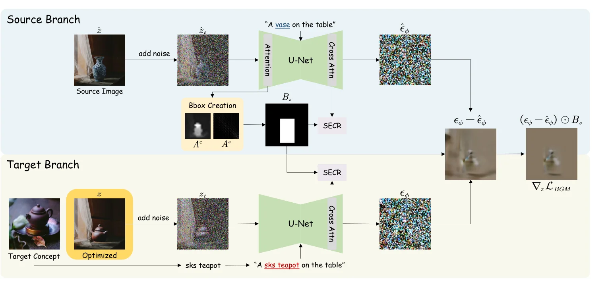

# 新增一作／共一：逐章、模块与图的学习卡

检索核查截至 2026-09-16，整理于 2026-09-17。这里的“逐章”是章节功能与主要论证路径拆解；不表示逐句校勘全部附录、复现公式推导或实验。P17–P26 延续原卡片编号，P16 是仅有框架图的 AKU。核心作品中的共同模式属于合作论文的公开表达，不能证明某一作者独立写作或绘图。

## P17｜Calligrapher：数据构造、风格表示与上下文注入

[固定版本 2506.24123v1](https://arxiv.org/abs/2506.24123v1)。2025 首发；Yue Ma 首位，与 Qingyan Bai 共一。已读摘要、主文章节、方法和实验设置；框架图为 PDF p4 Fig.4，数据图 p3 Fig.3。

**逐章怎么推进。** Abstract 把自由风格文字定制归结为风格控制与数据不足。Introduction 从人工排版成本和字体库局限切入，再解释生成式方法中风格精度、训练对不足的问题，用三个设计收束。Related Work 分文字渲染、文字定制和风格迁移，为不同贡献定位。Method 在基础模型后依次写自蒸馏数据、style attention、in-context learning；顺序是先解释监督从哪里来，再解释参考如何进入模型。Experiments 先设置，再展示 self/cross/non-text 应用，随后正式比较与消融。Conclusion 回收自由定制能力；主文未单设限制节，不能把未写限制当作值得效仿的格式。

**每个模块怎样拆。**

| 模块 | 输入 → 操作 → 输出／注入点 | 学习它的写法与验证 |
|---|---|---|
| 自蒸馏配对数据（3.2） | LLM 风格提示 → FLUX 生成文字图 → OCR 定位 → 同图局部风格参考与剩余目标文字 | 用数据生产规则解释风格一致监督；不是从无关图片随便配风格对 |
| Style attention（3.3） | 参考 → SigLIP、线性层、Q-former → 风格 K/V；denoiser 提供 Q → 加入主路径 | 冻结 FLUX 和可学习适配器分别写明；消融不能只展示最终好看样例 |
| In-context（3.4） | 像素参考与目标空间拼接 → 共享 VAE、上下文 self-attention；二值 mask 限定编辑 | 抽象风格 embedding 后仍缺局部细节，由新路径承接残留问题 |

**实验与句子边界。** 训练设置为 100k steps、8 张 A800、约 10 天；正式方法比较主要在 self-reference 的 100 张文字图上，含 FID、CLIP、DINO、OCR 与用户偏好。跨参考及非文字应用展示不能自动扩大成同样充分的定量结论。

**图怎么组织。** 上方放参考裁剪与 style encoder，下方保持主 latent 路线；style attention 用放大框，冻结／训练状态用图例。可迁移的是“数据图回答监督，框架图回答注入位置”的分工。

*原作者团队图，2506.24123v1，PDF p4 Fig.4；压缩裁剪用于学习，不能当作自己的方法图。*

## P18｜EEdit：先解释冗余发生在哪里，再写加速

[固定版本 2503.10270v3](https://arxiv.org/abs/2503.10270v3)。ICCV 2025；Yue Ma 第二作者，与 Zexuan Yan 共一。已读主文章节、主要方法和实验；框架为 PDF p4 Fig.3。

**逐章。** Abstract 用空间／时间冗余组织问题。Introduction 对齐编辑质量和计算成本，Related Work 区分生成加速与编辑任务。第 3 节给 rectified flow 基础。第 4 节用 SLoC、TIP、ISS 分担局部刷新、索引开销和 inversion 步数；第 5 节比较 prompt、drag、reference 编辑并消融；第 6 节回收质量—效率权衡。Fig.2 的诊断先于 Fig.3 的设计，Algorithm 1 让复用状态可追踪。

| 模块 | 输入 → 操作 → 输出 | 模块段应该回答的问题 |
|---|---|---|
| SLoC | 编辑 mask、邻域与缓存状态 → mask 加分、衰减 L1 邻域及陈旧计数 → 选择 attention/MLP 刷新 token | 编辑区为何需要不同预算；缓存多久必须刷新 |
| TIP | 固定随机图、mask 与计数规则 → 预计算索引序列 → 推理复用 | 为什么可以离线计算：索引不依赖当前特征评分，不能把所有 adaptive 策略都说成可预计算 |
| ISS | inversion 轨迹 → 减少求值并复用前态，末次完整 inversion → 保留 denoising 路径 | 跳的是 inversion 的求值，不能泛称所有采样阶段都等比例省略 |

**实验。** H20 上的耗时须绑定 backbone、分辨率、步数、编辑设置；PIE-Bench、TF-ICON、DragBench 的前景／背景指标回答不同问题。把 SLoC、ISS、TIP 分开消融，分别说明质量与节省来自何处。

**画图迁移。** 上下两行表示 inversion 与 denoising；缓存结构连接 token 放大框，跳步用明确跨步箭头。用不同位置／线型解释复用与真正执行，不能只用淡色让读者猜。

*原作者团队图，2503.10270v3，PDF p4 Fig.3。*

## P19｜Follow-Your-Color / MagicColor：实例控制需要匹配的数据与表示

[固定版本 2503.16948v2](https://arxiv.org/abs/2503.16948v2)。预印本 Follow-Your-Color 对应 ICCV 2025 的 MagicColor；Yue Ma 第二作者，与 Yinhan Zhang 共一。已读主文；框架为 PDF p5 Fig.3。

**逐章。** Abstract 明确多实例草图上色。Introduction 从完整参考上色推进到多个实例、各自参考与位置的控制要求；Related Work 给参考上色和扩散控制定位。Method 先定义草图 S、参考 R、mask M 到图像 I，再用数据分阶段训练、instance control 与优化目标分节。Experiments 在设置后比较、展示控制、移除组件；结论收束实例级控制。

| 模块 | 输入 → 操作 → 输出 | 可迁移的论证 |
|---|---|---|
| 两阶段数据（4.1） | 单帧动漫图配对 → SAM 实例随机融合、缩放、打乱和噪声 → 多实例训练样本 | 先学外观先验，再让数据具有目标控制组合；不能只画网络而略过监督差异 |
| Instance control（4.2） | DINOv2 dense features → 目标框／mask 对齐 → ControlNet 实例引导 | 空间对齐承担身份与位置对应；训练中部分空间特征替换成全局 embedding 增强变化覆盖 |
| 优化（4.3） | 生成图、边缘和语义对应 → 边缘加权扩散／感知及颜色相关约束 | 分清每项监督解决结构还是颜色，解释相应消融 |

主框架含 reference U-Net、main U-Net、草图与实例 ControlNet 路径。SD1.5、100k steps、2 张 A800；正式基线比较使用完整参考图，不能据此声称所有多参考组合均公平验证。复杂遮挡与多对象细节仍可失败；限制段的宣传性语言不作为模板。

**画图。** 训练路径、匹配过程、实例控制分区；语义浅色辅助追踪同一实例。图中的颜色要跨输入、mask 与 feature 保持一致。

*原作者团队图，2503.16948v2，PDF p5 Fig.3。*

## P20｜SkipVAR：把经验观察变成可执行决策

[固定版本 2506.08908v3](https://arxiv.org/abs/2506.08908v3)。2025 首发；Yue Ma 第二作者，与 Jiajun Li 共一。已读主文方法、设置、消融；框架为 PDF p6 Fig.5。

**逐章。** Introduction 先定位高分辨率自回归阶段的代价。Method 的 3.2 分析高频阶段收益递减及样例敏感性，3.3 才给频率特征和动作分类器；Experiments 比较速度、常规质量和高频质量，继续检验特征、决策阶段与泛化。结论回收按样例分配计算，而非宣称所有图都能同幅度跳步。

**模块七项的实例。** 目的：省去低收益的后期计算。证据：高频变化与样例收益不同。输入：特定阶段解码／缩放图。操作：Sobel 的 HF_Diff 与 Fourier 的 HF_Ratio 提取，轻量分类器选择提前结束、条件分支替代无条件 CFG 分支或完整计算。输出：剩余生成路径。状态：生成器固定，但 People3K 上训练决策分类器。验证：SSIM、LPIPS 及对应高频指标、时间、动作与特征消融。

**需要修正的表述。** 文中的 training-free 不能迁移为“系统完全不训练”；应表述为“不微调生成器、训练轻量决策器”。分类标签依赖 SSIM 阈值和可接受质量，不是自然界的最优策略标签；正文／设置的阈值差异也应先核对，不能机械抄数。

**画图。** 整条自回归尺度时间轴放上方，决策点和分类器放下方；让三种动作返回明确的终点。诊断散点图与 decision boundary 负责解释适应性，框架图负责解释执行。

*原作者团队图，2506.08908v3，PDF p6 Fig.5。*

## P21｜EVCtrl：把层、token、时间三个预算层级画清楚

[固定版本 2508.10963v2](https://arxiv.org/abs/2508.10963v2)。2025 首发；Yue Ma 第二作者，与 Zixiang Yang 共一，并有通信身份。已读主文；框架为 PDF p4 Fig.3。

**逐章。** Abstract 和 Introduction 指出控制适配器的额外成本；前置诊断用层响应、token 强度与时间相似性描述可压缩位置。3.1 总览，3.2 layer-focused caching，3.3 temporal caching，随后跨图像／视频控制任务评估与消融。结论围绕适配器预算回收。

**模块。** 层敏感性决定在哪些中后层集中工作；较高 L1 的控制 token 指导 attention／MLP 局部刷新。时间策略缓存 ControlNet 分支，在固定完整刷新间隔与关键时刻重新计算。输出是控制残差与特征的可用缓存，不是移除 backbone 全部时间步。写每个子节时先交代缓存对象，再写索引、更新与消费位置。

**实验。** latency、质量、控制精度分别评价；attention/MLP 与步选择消融不能互相替代。范数和重要性的关联是经验观察，不能改写成因果定理。PDF 的关键步不等式需和实现核对后再使用。

**画图。** 时间刷新循环、控制分支和选中 token 放大图并排，冻结 backbone 保持灰色底层。重复色块不是装饰，而是在多个层级追踪同一个缓存状态。

*原作者团队图，2508.10963v2，PDF p4 Fig.3。*

## P22｜Follow-Your-Instruction：数据系统也需要闭合的误差反馈

[固定版本 2508.05580v1](https://arxiv.org/abs/2508.05580v1)。2025 首发；Yue Ma 第二作者，与 Kunyu Feng、Xinhua Zhang 共一。已读主文；框架为 PDF p4 Fig.2。

**逐章。** Introduction 由世界数据标注不足推进到人工场景搭建成本，明确 MLLM 数据系统的意义。Method 以 Collector、Generator／Optimizer、Planner 组织资产、场景、行为；Experiments 先检验 MLLM 与场景质量，再验证下游微调，最后消融视角数和反馈。结论回收可控制数据合成。

| 模块 | 输入 → 操作 → 输出 | 为什么这样写 |
|---|---|---|
| Collector（3.1） | 多模态要求 → 资产清单 → 文本 top-k 检索与视觉选择 | 用可执行资产而非自由文字结束第一阶段 |
| Generator / Optimizer（3.2） | 资产与布局 → bbox、世界变换、投影 → 多视角渲染与 VLM 评分修订 | 单视角“看起来正确”可能是几何错觉；反馈解释新增计算的必要性 |
| Planner（3.3） | 场景状态与指令 → 动作帧 → 转换反馈与中间动作补充 | 场景正确和行为连续是不同目标，分别验证 |

**证据。** 七种应用展示与三个下游微调实验不能混写成“七项任务均训练验证”。视角数 1/2/3 的实验同时体现成本与可靠性。正文 Generator／Creator 称谓应统一后迁移。

**画图。** 四块彩色泳道保留真实场景截图与回环；正式栏宽下应压缩局部文字、另置细节面板。复杂系统图尤其需要让“输出失败→谁修订”可一眼追踪。

*原作者团队图，2508.05580v1，PDF p4 Fig.2。*

## P23｜InstanceAnimator：实例隔离与场景融合要分开表达

[固定版本 2603.25357v1](https://arxiv.org/abs/2603.25357v1)。2026 首发；Yue Ma 第二作者，与 Yinhan Zhang 共一。已读主文；选取 PDF p5 Fig.4 的条件与可见性图。

**逐章。** Introduction 从多实例草图视频上色提出实例串色、背景与文字条件的协调。3.1 定义输入输出，3.2 canvas conditioning，3.3 instance attention，3.4 多条件专家融合。4.1 实现，4.2 OpenAnimate 数据，4.3 定量，4.4 定性，4.5 消融；第 5、6 节继续用户与功能评价，第 7 节结论。数据放在实验设置内仍承担独立贡献，不应因为位置而漏掉。

**模块。** 用户 canvas 与 background 经 VAE 后和草图／噪声通道拼接；实例参考 token 不看其他参考，scene token 聚合参考信息，参考区域不计算生成损失；CLIP 的背景／实例条件与 T5 文本进入独立 cross-attention experts，经学习权重融合，背景权重冻结。写法上的关键是把“谁能看谁”与“哪类条件如何融合”分成两个问题。

**数据与实验。** OpenAnimate 42K 使用 SAM、RAM、GroundingDINO 及 Qwen Image Edit 补全等构造结构化样本。Wan 1.3B/14B、2 张 A800、20k steps 为所读设置。FID 主要反映帧图像分布，不能独立证明时间一致性；支持可变实例数量也不等于验证了无限扩展。

**画图。** 条件通道示意旁边放 attention visibility matrix；矩阵行列必须注明 Q/K 或读者／被读取 token。单栏小矩阵适合解释约束，大框架负责完整路径。

*原作者团队图，2603.25357v1，PDF p5 Fig.4；只含原图所在单栏区域。*

## P24｜MSEditor：跨镜头一致性需要数据和采样组织共同支持

[固定版本 2608.17559v1](https://arxiv.org/abs/2608.17559v1)。2026 首发；Yue Ma 第二作者，与 Kunyu Feng 共一。已读主文；框架 Fig.3、重投影 mask Fig.4、PDF p6 Fig.5 的 packing/attention。

**逐章。** Introduction 从镜头切换的几何跳变切入，说明训练数据不足和独立 chunk 编辑的双重问题。3.1 构造多视角代理数据，3.2 给监督适配器与镜头打包；Experiments 先建立多镜头协议，再比较同数据重训基线、视觉结果和关键消融；结论回收一致修改能力。

**模块。** 深度与相机双重投影产生 mask，Qwen3-VL 生成全局与逐镜头描述，构造 3400 组、每组 10 视角代理序列。零初始化 Supervisory Adapter 输入 RGB/mask，第一已编辑帧作为锚点。Shot packing 保存完整锚点镜头，并从 DINO 检索的 top-M 镜头取稀疏帧；超显存时调阈值。Sparse Cross-Attention 将全局 caption 与本镜头 caption 分配给对应 token，此组件继承 HoloCine，不能列为独创。

**实验。** 600 个测试视频及 2/4 镜头设置；VACE、VideoPainter 用同数据重训帮助区分数据收益和结构收益。第一帧、packing、sparse attention 消融对应三个主张。多视角代理不覆盖全部电影剪辑类型，“单次处理”也不等于任意长序列不受显存限制。

**画图。** 用锚点镜头和稀疏帧排列说明 packing，再以 block attention matrix 解释文本可见性；颜色同时标识镜头来源，避免矩阵与输入互不对应。

*原作者团队图，2608.17559v1，PDF p6 Fig.5。*

## P25｜InstantSwap：第三作者也可能是核心共一

[固定版本 2412.01197v2](https://arxiv.org/abs/2412.01197v2)；[官方项目](https://instantswap.github.io/)列 ICLR 2025。Yue Ma 排第三，与 Chenyang Zhu、Kai Li 共一；不能按作者序号漏掉。已读主文、主要模块、设置及消融；框架为 PDF p3 Fig.3。

**逐章。** Introduction 定义 Customized Concept Swapping，比较 attention 与 score distillation 两类方法，把问题整理为前景／背景一致性和效率。Related Work 定位图像编辑与概念替换。3.1 用 SD、SDS/DDS 定义优化对象，3.2 展开四个组件。4.1 设置，4.2 ConSwapBench，4.3 定性，4.4 定量，4.5 消融，4.6 扩展；结论回收两类问题。先展示 failure matrix 再展示算法，使每个模块有可见靶点。

| 模块 | 输入 → 操作 → 输出 | 对应证据与写法 |
|---|---|---|
| BBox | source cross-attention + self-attention → 幂增强与阈值 → 较宽目标框 | 框不是精确分割；解释为何给形状变化留空间 |
| BGM | 梯度与 bbox → 框外梯度屏蔽 → latent 更新 | latent 屏蔽不保证 VAE 解码后每个背景像素严格不变 |
| SECR | 区域图像 Q、source/target 概念文本 K/V → 局部 cross-attention → scatter 回两分支 | 用局部构图强调形状变化和概念注意力的对应 |
| SSGU | 间隔 λ 的 anchor gradient → 中间迭代复用 → 减少优化求值 | 复用的是 latent 优化迭代；不能与其他论文的采样步／层缓存混称 |

**实验与批判阅读。** 目标概念先有 DreamBooth 定制 checkpoint；“training-free swapping”不代表端到端无训练。所读配置为 SD2.1、RTX3090、550 次 SGD 更新、λ=5 等；19.83 秒仅在该协议成立。ConSwapBench 的概念／图片组合产生 1600 任务；前景 CLIP-I、背景 PSNR/LPIPS/MSE/SSIM 和总图 CLIP-T 分别检验不同不变量。Table 3 中 GT 生成／GT 评价的 75.79 高于自身框生成／GT 评价的 75.00，与正文更强的前景优势解释不一致；学会按数值降强度，而非复制漂亮结论。

**画图。** source/target 双分支共用 bbox，两个噪声预测汇到差值，再经 mask 更新；SECR 和 SSGU 分别用空间放大图与迭代时间轴解释。

*原作者团队图，2412.01197v2，PDF p3 Fig.3。*

## P26｜Follow-Your-MultiPose：短论文可以合并背景，但不能省掉逻辑

[固定版本 2412.16495v2](https://arxiv.org/abs/2412.16495v2)。2024 首发；2025/26 venue 未确认，作为额外较早共一纳入。PDF p1 明示 Beiyuan Zhang 与 Yue Ma 等贡献，Yue 排第二。已读主文方法与实验；Fig.2 为 PDF p2 框架，本卡未新增视觉裁剪。

**逐章。** 摘要定义多角色姿态引导生成；Introduction 同时承担现状、局限和部分 related work，随后直接进入 II. Method、III. Experiments 与 Conclusion。没有独立 Related Work 或 Preliminaries；可学习章节的职能，不能强迫每篇论文都采用同样标题。

**模块。** Pose 非零行列得到角色框／mask，经角色维度 softmax 并缩放到各 U-Net/ControlNet 分辨率；LLM 将整体描述拆成角色描述及共享场景。Spatial-Aligned Cross-Attention 复制 hidden state，用各角色 prompt 的 K/V 计算，再按 mask 融合。Multi-Branch Control 给每个 pose/prompt 建 ControlNet 分支，融合 down/mid 残差；第一分支不施 mask 的设计应和对应消融一起解释。

**实验。** AnimateDiff、SD1.5、DWPose 与个性化 T2I checkpoint；文本 CLIP、邻帧 CLIP、姿态精度和 20 人用户研究。对角色 1、角色 2、背景分别看一致性，有利于暴露“总体平均好看但串角色”的失败。主要测试两个角色，不能把形式上的 N 路分支写成已验证的大规模扩展。

**可迁移图法。** 把整体 framework 与“按角色计算→mask 融合”的局部细节分成两张图；图中的角色颜色应沿 prompt、pose、attention 和输出一致。该建议基于主文描述与图注，未在本轮逐像素核查 Fig.2。

## 从新增核心作品抽出的选择规则

| 你的研究结构 | 更适合参考 | 真正该迁移的单位 |
|---|---|---|
| 条件与监督都缺失 | Calligrapher、Instruction、Color | 数据产生规则 → 可用条件 → 模型注入 → 下游验证 |
| 多角色／多条件串扰 | MultiPose、InstanceAnimator | 可见性／隔离 → 聚合 → 分角色评价 |
| 空间／时间计算冗余 | EEdit、EVCtrl、SkipVAR、InstantSwap | 诊断粒度 → 决策信号 → 更新规则 → 质量成本边界 |
| 跨镜头／跨块不一致 | MSEditor | 数据代理的适用范围 → 锚点 → 上下文打包 → 匹配基线 |

这些是分析后的工作建议，不是证明 idea 实际诞生顺序的作者自述。每次写新论文仍要检查最近工作与自己的代码／实验。
