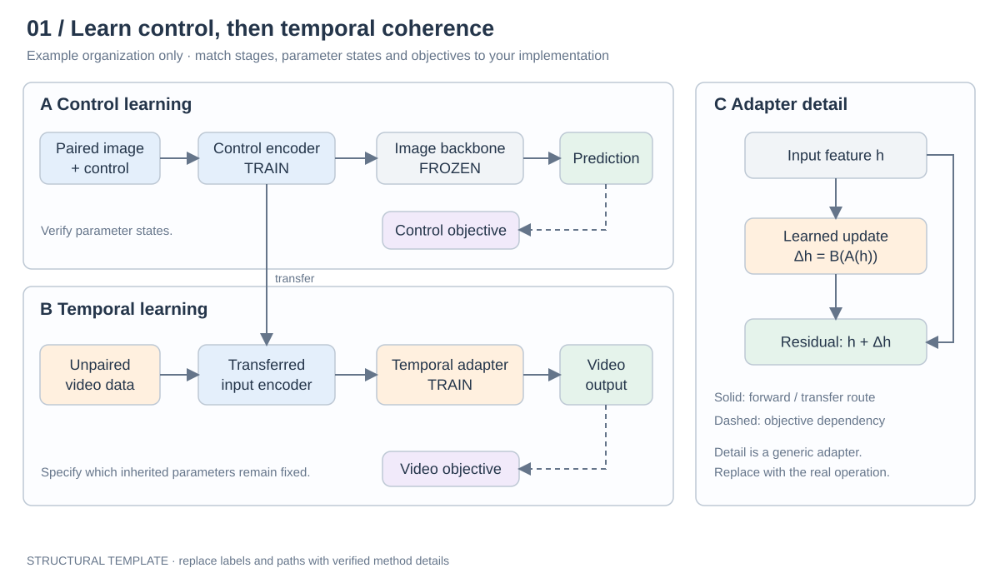
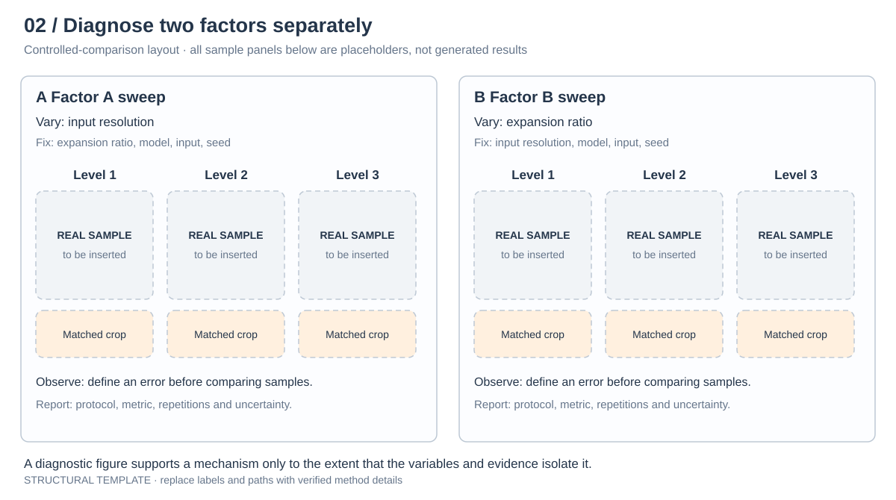

## 07｜图到底怎么画：工具证据与可执行做法

### 7.1 公开文件能确认哪些工具

这里依据 arXiv 源码包内独立图文件的 PDF metadata 与嵌入字体，不根据图片长相猜软件。

| 原始文件 | 可核实信息 | 能得出的结论 |
|---|---|---|
| Canvas `figures/infer.pdf` | Creator / Producer 为 Microsoft® PowerPoint® LTSC；Author 字段为 ma yue | 这份图经过 PowerPoint 导出；作者字段不能证明全部绘图由谁完成 |
| Canvas `figures/motivation_ratio.pdf` | Creator / Producer 为 Microsoft® PowerPoint® LTSC | 动机图也可以用 PPT 拼版和标注 |
| Canvas `figures/davis.pdf` | Creator 为 WPS 演示 | 同一篇的图不一定使用同一种工具 |
| Canvas `figures/show.pdf`、`user.pdf` | Matplotlib v3.7.5 / PDF backend | 数值图有程序化绘制证据 |
| Pose `images/framework2.pdf` | Chalkboard、BradleyHandITCTT-Bold、CambriaMath、AppleColorEmoji | 框架标签、数学与状态图标采用不同字体 |
| Emoji `images/framework_0520.pdf` | ChalkboardSE-Regular、AppleColorEmoji | 手写感标签与状态图标有字体证据 |
| Motion `images/framework0921.pdf` | ChalkboardSE-Regular、SegoePrint-Bold、SegoeUIBlack-Italic、AppleColorEmoji | 不同层级标签使用多种字体 |
| Canvas `figures/infer.pdf` | ArialMT | 系列也存在干净的无衬线视觉路线 |

Pose／Emoji／Motion 部分图的 Producer 是 macOS Quartz PDFContext，它是 PDF 输出组件，**不能据此判断用了 Keynote 还是 PowerPoint**。本次源码包未发现可编辑的 `.pptx`、`.ai`、`.fig`、`.drawio` 原稿。因此下文提供的是原创复用模板与制作步骤，不声称拿到了作者的编辑工程。

### 7.2 真正反复出现的视觉组织

**颜色承担语义。** 控制、外观、时间、监督等不同路线使用稳定颜色；同一对象在输入、模块和输出中保持颜色。Canvas 的源／目标窗口颜色贯穿坐标、布局和公式。颜色并非每篇固定一套，复刻时先定义你自己的语义映射。

**总图和局部放大分工。** Pose 的主图给阶段和路由，旁边放 block 细节；MagicStick 的总图定位 ReMix，再用独立图解释混合；Group Editing 让主流程与 RoPE 坐标说明相邻。主图回答模块在何处，放大图回答操作如何发生。

**把时间画成空间。** Emoji 的训练／推理分层；DiT4Edit 的 inversion／editing 对齐；LiveLight 用滚动窗口标出过去、当前和未来。只有视频帧缩略图而没有时间语义，往往不能解释时序机制。

**冻结状态是计算信息。** 图标、文字或图例标记 frozen／trainable，损失用不同连接方式。为了跨平台可靠，自己的模板用文字徽标，避免只靠 emoji 字体。

**动机图承担论证。** Canvas 的两因素比较不是装饰：它让读者接受为何分窗。Motion 的实测响应与理想结构示意要明确区分，示意矩阵不能冒充实测 attention。

### 7.3 七类图的制作配方

| 图类型 | 先写一句它要证明什么 | 应放的元素 | 制作次序 | 最容易误导的地方 |
|---|---|---|---|---|
| Teaser | 在何种控制下能获得何种结果 | 输入、控制、少量时间点、输出、操作标签 | 定好任务对照 → 选真实样例 → 同尺度裁剪 → 添控制箭头 | 只选漂亮图却看不出控制发生在哪里 |
| Motivation | 一个具体因素是否导致失败 | 固定条件、被改变的因素、同源输入、局部放大、可量化现象 | 固定实验协议 → 生成样例 → 统一裁剪 → 标失败位置 | 同时改变分辨率、比例、模型和种子后归因 |
| Framework | 数据怎样流经关键改动 | 数据来源、编码器、骨干、接入点、输出、训练状态 | 列节点与依赖 → 排主路径 → 加支路 → 加图例 → 对齐 | 箭头好看但不能对应真实计算 |
| Module zoom | 输入如何变成中间表示 | token／窗口／坐标、最小操作、对应关系、输出 | 只画必要元素 → 逐个追踪对应 → 和总图同名 | 用一块叫 Fusion 的盒子掩盖真正机制 |
| Qualitative grid | 在同样任务上差异在哪里 | 行为方法、列为样例或时间、真实输出、同一裁剪 | 统一协议 → 脚本拼版 → 标区域 → 加说明 | 用不同时间点或不同缩放夸大优劣 |
| Ablation / trade-off | 哪个设计带来什么收益与代价 | 完整模型、移除／替代、设置、时间与质量 | 从日志出表 → 检查单位 → 程序画图 → 提供来源 | 只报最佳数，不报配置／失败或成本 |
| Streaming timeline | 控制何时可用，输出何时产生 | 输入到达、已输出历史、活动窗口、待生成帧、时钟 | 定义时间变量 → 排因果顺序 → 标刷新动作 | 用 FPS 代替首帧和控制响应延迟 |

### 7.4 用 PowerPoint / Figma / Inkscape 画框架的实际步骤

以下尺寸是**制作建议**，并非从作者文件反推的统一标准。最终以目标会议模板的可用宽度为准。

1. **先决定最终宽度。** 双栏通栏图可先按约 178 mm 宽排版，单栏约 85 mm；具体模板若不同就改。以最终印刷尺寸检查文字，不靠编辑器放大效果。
2. **列语义清单。** 用表记录节点 ID、名称、输入输出、训练状态和颜色角色。先画唯一完整主路径，再补支路。一个图通常只突出少数改动，其余骨干降低饱和度。
3. **搭基础组件。** 矩形用于张量／模型，圆角容器用于阶段，叠片表示序列，虚线框表示分组。定义组件后复制，避免每个盒子圆角、线宽都不同。
4. **分层摆放。** 背景分区 → 数据与模块 → 连线 → 标签与公式 → 图例。PowerPoint 用选择窗格命名和分组；Figma 用 Frames / Components；Inkscape 用图层与对象 ID。
5. **先连线再装饰。** 主流向一致，尽量水平或垂直；跨线用桥接或绕行。损失连接用虚线并在图例明确“监督关系”，不要把它画成推理输入。
6. **排字。** 最终宽度下标签建议约 8–10 pt，小注释尽量不低于 7 pt；线宽从 0.6–1 pt 起。若用手写字体，只给短标题或少量模块标签；公式与长注释用清晰字体。字体可用性不足时采用 Arial / Helvetica 等替代，不分发未授权字体。
7. **约束颜色。** 可以从灰色骨干、蓝色控制、绿色外观、橙色时序、紫色损失开始，但每个颜色都要有职责；同时保留文字、线型和位置线索，避免只靠红绿区分。
8. **放真实图像。** 保留输入素材 ID、视频时间点、裁剪区域与对应输出。标注必须可编辑；输入图不作为可随意美化的底图。
9. **导出检查。** 保留 `.pptx`／`.fig`／`.svg` 编辑文件，论文用矢量 PDF。核对字体、透明度、剪裁和数学符号；插入论文后再按实际尺寸检查。位图样例的有效像素由最终尺寸决定，单纯加 DPI 数字不会增加细节。

如果在 PowerPoint 中插入本手册的 SVG，可以作为整体缩放；支持的版本可尝试“转换为形状”继续编辑，但不同版本对文字／箭头转换不一致。需要稳定逐元素编辑时用 Figma 或 Inkscape 打开 SVG。没有测试过特定 PPT 版本时，不承诺转换后所有对象完全保真。

### 7.5 本手册提供的四张原创模板

下列图只包含结构示意和明确的结果占位框；**不包含实验数据，不是作者原图，也不是已验证的新模型**。替换时先改语义和连接关系，再改样式。

| 文件 | 适用写法 | 必须替换／核验 |
|---|---|---|
| [01-framework.svg](../assets/01-framework.svg) | 控制学习 → 时序学习；主路与细节分区 | 两阶段是否真实存在，哪些模块冻结、损失作用哪里 |
| [02-motivation.svg](../assets/02-motivation.svg) | 因素 A 与因素 B 的独立诊断 | 轴和固定条件、真实输出、指标与重复次数 |
| [03-window-alignment.svg](../assets/03-window-alignment.svg) | 全局上下文＋局部位置／对应 | 坐标系、共享表示、接入点、窗口重叠的实际定义 |
| [04-streaming.svg](../assets/04-streaming.svg) | 在线控制＋滚动窗口 | 系统是否因果，状态复用、实际时间戳和延迟定义 |

四张 SVG 的可复用绘图源代码是 [generate_templates.py](../scripts/generate_templates.py)。它只使用 Python 标准库；在目标目录运行可重建模板。改动节点和标签后，应重新检查连线及图文一致性。

### 7.6 图注怎么写

图注也是论证段落。建议顺序：图展示什么 → 各 panel 做什么 → 符号和颜色如何读 → 能从图中观察什么 → 必要条件。方法图不必假装自己提供效果证据；结果图则要交代输入、条件和指标。

原创框架图注模板：

> Overview of [method]. (a) [stage] maps [input] to [representation]. (b) [operation] uses this representation to [purpose]. Solid arrows denote [data flow], while dashed arrows indicate [supervision]. Parameters marked [label] are updated during [stage].

原创动机图注模板：

> Controlled analysis of [factor]. We vary [variable] while fixing [conditions]. Each column uses [shared input/protocol]. The highlighted regions show [observed difference], suggesting [bounded interpretation].

“suggesting”仍然需要证据；单个定性例子可以展示失败模式，但无法单独支持普遍统计结论。
