## 04｜逐篇拆解：问题、模块、章节与图

本节的“章节写法”是对各节论证功能的归纳，不是逐字翻译。公式级实现应回到相应版本的方法与代码；下面覆盖核心模块，不将每一层卷积都当成创新。

### P01｜Follow Your Pose：用数据分工组织整篇论文

[原文：2304.01186v2](https://arxiv.org/abs/2304.01186v2)

**任务与冲突。** 用文本控制内容、姿态序列控制动作；大规模姿态—视频—文本配对难以获得。核心转向是分别学习姿态控制和视频连贯性，而不是要求一次获得完整配对数据。

| 核心模块 | 输入 → 输出／机制 | 训练或使用位置 | 应学习的论证 |
|---|---|---|---|
| 姿态编码器 | 姿态图 → 可注入图像扩散网络的特征；零初始化连接减小初始扰动 | 第一步用图像—姿态对学习，利用预训练 T2I 先验 | 先解释配对数据可获得性，再解释结构 |
| Temporal self-attention | 单帧特征 → 跨帧相关特征 | 第二步从不带姿态标注的视频学习 | “视频连贯”需要独立的数据来源 |
| Reformed cross-frame attention | 改造帧间信息交互以维持一致性 | 视频训练与推理 | 写清楚相对原 attention 改了什么 |
| 两阶段参数分工 | 第一阶段控制能力 → 第二阶段视频能力 → 姿态序列条件生成 | 不把全部参数同时任意训练 | 冻结／更新范围是方法的一部分 |

**各章节怎么写。**

- **摘要：** 任务能力 → 三元配对数据障碍 → 两阶段分解 → 姿态控制和视频结果。标题中的“using Pose-Free Videos”已经承担了核心反差。
- **Introduction：** 先交代 T2V 的能力与控制缺口，再把数据需求落到姿态配对上；随后说明为什么图像数据与无姿态视频可以各负其责。贡献围绕数据与训练策略，而非只列网络部件。
- **Related Work：** Text-to-Video、Pose-to-Video、Controllable Diffusion Models 三组，分别交代生成先验、任务邻居和条件注入背景。
- **Method：** LDM 预备知识 → Pose-guided T2V；正文按两阶段讲，图也按两阶段排。每一阶段应能回答“什么数据、更新谁、得到什么能力”。
- **Experiments：** Implementation → Applications → Baselines → Ablation。应用展示范围，比较检验效果，消融检查注入位置与训练设计。
- **Conclusion：** 回收“无需完整姿态视频配对也能学习控制”这一贡献。没有必要再长篇复述扩散背景。
- **补充材料学习点：** 当前正文已承担关键机制说明；不要把决定两阶段是否成立的冻结细节移出正文后完全不交代。

**看图。** p1 Fig.1 的数据逻辑、p3 Fig.3 的训练／推理结构、p7 Fig.8 的注入消融形成一条链。框架图左边两阶段、右边推理和 block 放大；灰色骨干弱化既有组件，色块强调改动。p7 Table 1 不是所有指标都第一，写结果时应保留指标边界。

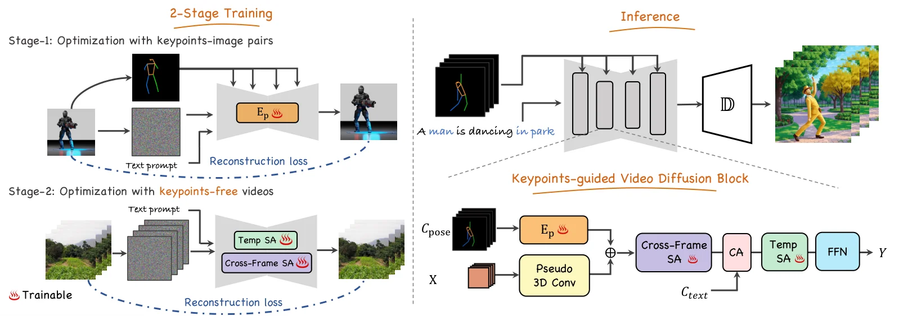

*来源：P01，Fig.3；原图为作者团队作品，本手册使用压缩预览进行分析。*

### P02｜MagicStick：从用户编辑动作写到 attention 机制

[原文：2312.03047v2](https://arxiv.org/abs/2312.03047v2)

**任务与冲突。** 用户希望改变物体的位置、尺度、形状或运动，而仅靠文本更擅长改变语义／外观。把视频内部控制信号变成可操作的 handle，再保留未编辑区域。

| 核心模块 | 输入 → 输出／机制 | 训练或使用位置 | 需要解释的原因 |
|---|---|---|---|
| 视频 customization | 源视频及条件 → 定制的生成路径；扩展时间层、LoRA、学习 token | 针对源视频调适 | 使模型记住该视频的外观与动态 |
| 控制信号提取 | 分割／跟踪结合 pose、edge 或 depth → 可编辑控制序列 | 预处理 | 几何修改要有稳定的作用对象 |
| 控制信号变换 | 用户改关键帧位置／尺度 → 向其余条件帧传播 | 推理交互 | 将少量操作变为连续条件 |
| 引导 inversion 与 denoising | 源视频、修改前后条件 → 编辑输出 | 推理 | 重建源信息并引入新结构 |
| Attention ReMix | inversion 保存的 attention + 目标结构引导；由 cross-attention 构造对象 mask，混合背景与目标信息 | attention 层内 | 解决复杂形状编辑与背景保持冲突 |

**章节写法。** 摘要与 Introduction 先说“能编辑哪些属性”，再说明文本语义编辑不够；Related Work 以 Video Editing 与 Image and Video Generation 建立边界。Method 的真实顺序是 Preliminary → Controllable Video Customization → Control Signal Transformation → Controllable Video Editing，沿着用户任务执行顺序写。Experiments 先 Applications 后 Comparisons，再用 Ablation Studies 拆 customization 和 ReMix 的作用。Conclusion 回收可控属性与控制信号变换。当前 PDF 对额外补充材料的系统覆盖有限，不据此编造附录结构。

**图如何组织。** p4 Fig.3 左侧画 customization，右侧画 inversion／denoising，条件变换放在右上方；p5 Fig.4 再解释 ReMix。结构图解决“在哪儿”，局部图解决“怎么混”。p7 Fig.7、p8 Fig.8 是回查机制的消融位置。

**可迁移写法。** 如果你的论文支持多个操作，先把它们统一到一个中间表示，再写这个表示如何变换。不要让 Method 变成每种交互各一套独立网络的目录。

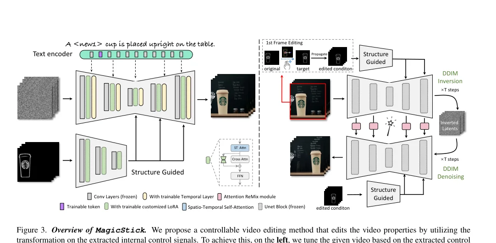

*来源：P02，Fig.3 图区域裁剪。*

### P03｜Follow-Your-Click：接口要求决定数据与网络

[原文：2403.08268v1](https://arxiv.org/abs/2403.08268v1)

**任务与冲突。** 输入一张图、点一个对象、给一个短动作词，让目标动起来。传统长 caption 主要描述图像内容，不能直接提供良好的动作监督；模型还容易只依赖首帧而不产生动作。

| 核心模块 | 输入 → 输出／机制 | 训练／推理 | 消融要回答什么 |
|---|---|---|---|
| 区域条件 | 点击 → SAM 对象 mask；训练通过光流构造运动区域 | 两阶段接口不同 | 区域是否选对了动作主体 |
| 首帧条件与 masking | 首帧 latent、噪声和 mask 组成条件；随机遮挡首帧内容 | 训练，9 通道输入设计 | 是否缓解对首帧的过度依赖 |
| WebVid-Motion | 视频 → 动作导向短描述；使用 GPT-4 重标注 | 数据构造 | 数据变化本身贡献多大 |
| Motion-augmented cross-attention | 动作文本 → 运动模块条件 | 模型条件注入 | 短动词如何影响动态 |
| Flow-based strength | 区域平均光流幅值 → 运动强度 embedding | 学习与推理控制 | 相比 FPS 是否更贴合运动幅度 |

**章节写法。** 摘要先给“click + short prompt”接口，再解释为此增加的数据和机制。Introduction 从用户意图不易用完整文本表达切入，逐步引出局部化与动作描述需求。Related Work 用 Text-to-Video Generation 和 Image Animation 对照任务差异。正文先给预备知识，再在 Method 中以 Problem Formulation 明确输入；Regional Image Animation 解释区域与语义；Temporal Motion Control 解释强度。Experiments 按 Implementation、Baselines、Ablation、Application 排列。Conclusion 几乎按“用户能力 → SAM → 动作模块与数据 → 首帧 masking → 光流强度”复盘，是功能到实现的压缩版。

**图文证据。** p6 Fig.2 总览；p11 Fig.4 改 masking；p12 Table 2 与 p13 Fig.7 看数据／motion augmentation；p13 Fig.8 比较 flow 与 FPS。读消融时要检查是否隔离了重标注数据和架构改动。

**易读错之处。** 点击／mask 用于选对象，不应理解为所有运动必须留在初始 mask 内。“区域控制”与“像素不得越界”是不同任务。

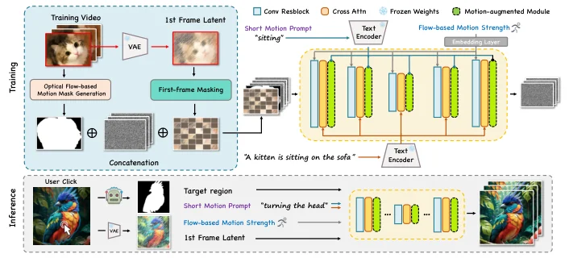

*来源：P03，Fig.2 图区域裁剪。*

### P04｜Follow-Your-Emoji：用表示、损失和生成策略解决三个层次

[原文：2406.01900v3](https://arxiv.org/abs/2406.01900v3)

**任务与冲突。** 将驱动表情迁移到真人、卡通、雕像或动物画像，同时保持参考身份、细微表情和长时间一致性。这几个目标对应不同层次的设计。

| 核心模块 | 输入 → 输出／机制 | 位置 | 方法段落的重点 |
|---|---|---|---|
| Expression-aware landmarks | MediaPipe 3D 信息投影成表情条件；去除携带身份轮廓的点，保留局部五官／虹膜，再对齐参考 | 驱动信号预处理 | 为什么原表示会泄漏身份或忽视夸张表情 |
| Landmark encoder | landmark 序列 → 条件特征，与多帧噪声融合 | 去噪网络输入 | 接口与空间对齐 |
| Appearance net + image prompt | 参考图 → 外观特征；CLIP／Qformer 提供图像条件 | 去噪中多处注入 | 区分继承的参考建模与本文重点改动 |
| Facial fine-grained loss | 表情区域／脸部 mask → 加权的细粒度训练约束 | 训练 | 全局损失为何不足以关注小区域 |
| Progressive strategy | 先生成关键帧，再以端点条件插值 | 长视频生成 | 如何让局部生成过程承担长期一致性 |

**章节写法。** 摘要直接报任务，列身份／表情／时序三类挑战，随后重点解释 landmarks 和 loss，再扩展到长视频与 EmojiBench。Introduction 从自由风格人像的域差异与细表情出发，贡献不能全部压成“加 adapter”。Related Work 分 GAN-based 和 Diffusion-based Portrait Animation；段尾回到细表情与跨风格任务。Method 先给整体框架，再解释表示、损失、长序列策略；Experiments 在 self-reenactment、cross-reenactment 与用户评价中区分重建和泛化。Conclusion 还回收训练数据、progressive strategy 和 benchmark，说明论文贡献不仅是网络。补充部分用于更多案例和实现，但不能替代正文中 landmark 设计的必要说明。

**图与证据。** p5 Fig.2 是上下两层的训练／推理图；p6 Fig.4 展示损失 mask；p8 Fig.6–7 与 p7 Table 2 对齐 landmark／loss 消融。框架中蓝、粉、绿三个区域对应 progressive、image prompt 和 appearance 分支；紫色虚线表示损失。红框关键帧在推理图中保持同一语义。

**边界。** 去掉身份信息也可能损伤控制信息，必须通过跨身份与细表情实验共同判断。论文训练使用 32 张 A800，不能把整条研究路线描述成低算力工作。

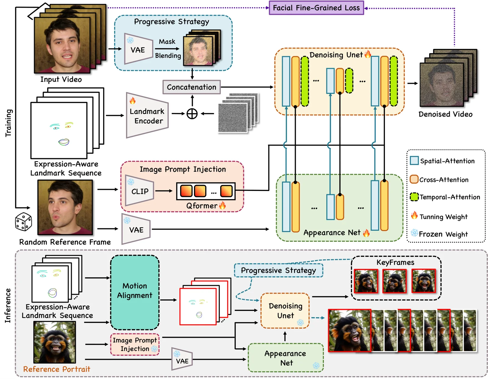

*来源：P04，Fig.2；源码文件 images/framework_0520.pdf。*

### P05｜COVE：把预训练特征的性质写成计算方法

[原文：2406.08850v2](https://arxiv.org/abs/2406.08850v2)

**任务与冲突。** 用图像扩散模型编辑视频，逐帧处理缺少显式时序约束。论文把扩散特征中的跨帧对应关系变成 attention 的取样依据。

| 核心模块 | 输入 → 输出／机制 | 使用位置 | 证据落点 |
|---|---|---|---|
| Diffusion feature extraction | 源视频 → 各帧的扩散特征 | 编辑前 | 对应关系是否可用 |
| One-to-many correspondence | 特征相似度 → 每个 token 的跨帧 top-K 对应 | 局部滑窗搜索，沿帧推进搜索中心 | K 的敏感性，p9 Table 2 |
| Correspondence-guided attention | 对应 token → K/V；令 attention 沿对应关系交互 | inversion 与 denoising | p4 Fig.3、p17 Fig.11 |
| Temporal token merging | 多个相关时序 token → 合并后计算 | attention 前后 | p10 Table 3 的质量／代价 |
| 搜索窗口 | 全局 all-pairs → 受限邻域搜索 | 对应计算 | p5 Fig.4；p15 Table 4／Fig.9 |

**章节写法。** 摘要：缺时序约束 → inherent feature correspondence → 获取对应 → 在反演和去噪中使用 → 质量与效率。Introduction 的重点是“模型本来包含什么，但现有编辑没有有效使用”。Related Work 分生成基础与 Text-to-Video Editing，定位在预训练模型的使用方式。Method 是 Preliminary → Correspondence Acquisition → Correspondence-guided Video Editing，明确区分“拿到信息”与“用信息”。Experiments 是 Setup → Qualitative → Quantitative → Ablation，附录继续给 K、window、merging、inversion 细节与 limitations。Conclusion 再按对应关系、attention、合并三步收束。

**图法。** p4 Fig.3 用 (a) 对应获取、(b) attention 使用、(c) 完整流程分面。网格、连线与同色 token 让“相同位置”与“相同物体对应”可区分。最值得学的是把中间表示的产生和消费分别画清楚。

**边界。** 论文方法强调无需额外训练或优化；不要与 FastVMT 的推理梯度优化混为一谈。特征对应的失败会传递到编辑，静态热图不是完整的时序质量证据。

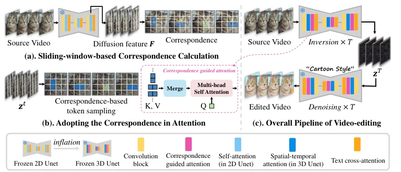

*来源：P05，Fig.3 图区域裁剪。*

### P06｜Follow-Your-Canvas：最适合逐段临摹论证骨架的一篇

[原文：2409.01055v1](https://arxiv.org/abs/2409.01055v1)

**任务与冲突。** 大幅扩画时，整幅视频输入受显存约束；缩小输入丢失细节，高扩展比例又提高生成难度。分窗解决局部生成，随后必须解决窗口间布局冲突。

| 核心模块 | 输入 → 输出／机制 | 阶段 | 失败—机制对应 |
|---|---|---|---|
| 随机 anchor／target window | 同一视频中不同位置与重叠程度的窗口 → 训练对 | 训练 | 学习灵活的相对空间关系 |
| 空间滑窗 | 大画布 → 固定尺寸局部任务 | 每个去噪步 | 保持局部分辨率，降低单窗未知内容比例 |
| Gaussian merging | 多窗口去噪结果 → 大画布结果 | 每一步都合并 | 平滑窗口衔接，不是仅最终拼接 |
| Layout Encoder（LE） | SAM 特征 → 布局提取 → Qformer tokens | cross-attention 条件 | 单窗看不到全局布局 |
| Relative Region Embedding（RRE） | anchor／target 偏移与尺寸 → 编码与 FC → 加到布局 token | 布局条件 | 同一全局布局对不同窗口应有不同解释 |
| 窗口并行 | 独立窗口任务 → 多 GPU 调度 | 推理 | 降低耗时，但仍消耗总计算 |

**章节写法。** 摘要将任务范围与两个策略绑定。Introduction 不是直接介绍模块：先定义任务，再测已有方法，再用双因素实验找原因，提出空间分窗，接着发现残留布局问题，引出 LE／RRE，最后报告结果与贡献。Related Work 只用 Diffusion Models 和 Video Outpainting 两组，第二组用分辨率／面积比定位缺口。Method 分清训练与推理；Experiments 用不同分辨率和扩展比例比较，之后验证 LE／RRE，另报告 runtime。Conclusion 重申任务与两类策略，紧跟具体局限：更多窗口可能增加推理时间。附录扩充结果和细节。

**图文证据。** p3 Fig.3 分离两因素；p4 Fig.4 说明局部合理不等于全局合理；p5 Fig.5／6 分别讲训练与推理；p8 Table 3／Fig.8 对齐消融。布局编码来自 **SAM**，不是 CLIP。9× 是约 9 倍面积，不是宽高各 9 倍。

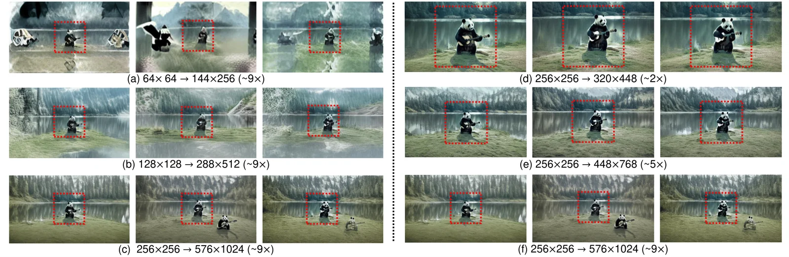

*来源：P06，Fig.3。左组固定扩展面积比研究分辨率，右组固定源分辨率研究扩展比。*

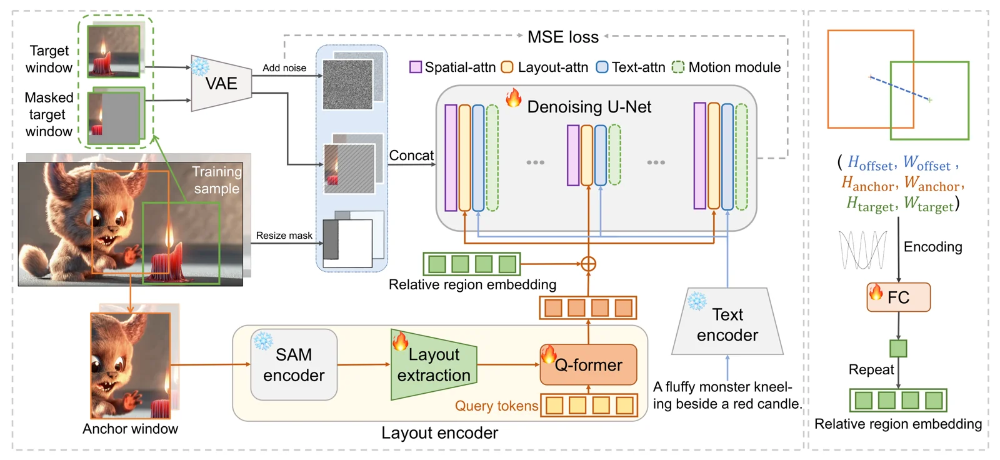

*来源：P06，Fig.5；橙／绿分别贯穿 anchor 与 target 的窗口、参数和连线。*

### P07｜DiT4Edit：骨干变化必须落实到编辑流程

[原文：2411.03286v2](https://arxiv.org/abs/2411.03286v2)

**任务与冲突。** 将图像编辑建立在 PixArt-α 的 DiT 上，既要保留源内容，又要减少反演／编辑代价。论文组合求解、attention 控制与 token 计算优化。

| 核心模块 | 输入 → 输出／机制 | 作用 | 写作重点 |
|---|---|---|---|
| DPM-Solver++ inversion | 源图像 → 可供重建／编辑的噪声 latent | 改善反演与步数权衡 | 为什么 inversion 误差影响编辑 |
| Unified attention control | 源／目标的 cross-attention 与 self-attention Q/K/V 调度 | 语义变化与结构保持 | 哪类信息由哪种 attention 承担 |
| 深层 query 分析 | 不同层 Q 特征 → 布局相关观察 | 解释控制选择 | 用表示证据支撑模块位置 |
| Patch merging／unmerging | 按相似度合并部分 token → attention → 恢复尺寸 | 降低计算 | 合并率、布局与细节的权衡 |

**章节写法。** 摘要先给编辑限制，再引出 DiT 与三个部件。Introduction 将 inversion 开销与骨干能力作为两个动机。Related Work 分 Text-to-Image Generation 和 Interactive Image Editing。Method 用 LDM 预备知识、架构差异和 DiT 编辑流程递进；Experiments 按 Implementation、Qualitative、Quantitative、Ablation。Conclusion 同时讨论尺度能力；随后单列 Limitation，指出 T5 分词问题及颜色不一致，另有社会影响说明。当前 9 页版本没有可替代正文的完整技术附录，不能声称已审核其所有补充实验。

**图文证据。** p4 Fig.2 将 source reconstruction 与 target editing 上下对齐；p5 Fig.3 展示 query，Fig.4 解释 merging；p7 Table 2／Fig.6 检查合并、Fig.7 检查反演。注意 Fig.2 在所读版本 p4，不能引用到 p3。

**批判学习。** 其“DiT 优于 UNet”叙述容易把模型规模、训练数据和架构混在一起。你的论文应在可比条件下报告效果，避免把骨干变化本身写成充分的因果证明。

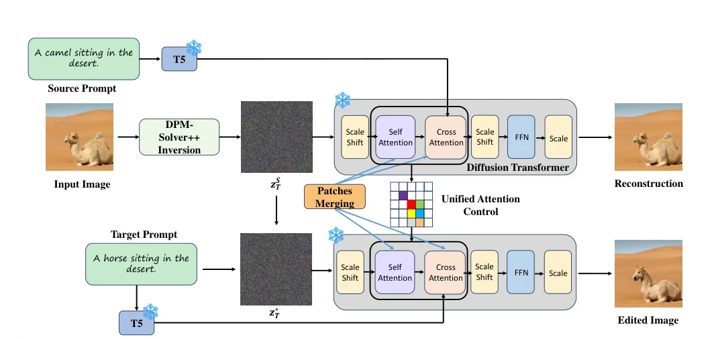

*来源：P07，Fig.2 图区域裁剪；两条路径中相同组件垂直对齐。*

### P08｜Follow-Your-Creation：重写任务，让已有先验可用

[原文：2506.04590v1](https://arxiv.org/abs/2506.04590v1)

**任务与冲突。** 从视频进行相机重定向与内容修改。将动态场景重投影后出现的未知区域，转成视频 inpainting 的输入；大视角变化、监督不足与跨视角一致性需要各自处理。

| 核心模块 | 输入 → 输出／机制 | 阶段 | 解决的问题 |
|---|---|---|---|
| Dynamic point cloud | 视频与 DepthCrafter 深度 → 动态点云 → 新相机视角投影 | 数据／条件构造 | 把相机操作变为显式可见区域与空洞 |
| Double reprojection | 新视角投影再回到原视角 → 带缺损／原始视频对 | 监督构造 | 没有新视角真值时如何利用现有数据 |
| Composite mask | 可见性、点云空洞及编辑需求 → 组合 mask | inpainting 条件 | 同一任务接口容纳相机与内容改变 |
| Self-iterative tuning | 小视角变化开始，逐步扩大并利用生成结果 | 调适 | 大幅运动下的训练分布缺口 |
| Temporal packing | 从已有输出挑选有帮助的帧，作为新轨迹条件 | 推理 | 维持不同视角生成之间的关联 |

**章节写法。** 摘要的支点是“reformulate … as video inpainting”，再按监督、训练、推理三个问题展开。Introduction 解释为什么相机与内容编辑值得统一，以及直接依赖既有方案的不足。Related Work 分 Camera-controlled Video Generation、Video Editing/Inpainting、Dynamic Novel View Synthesis，三个邻域共同定位任务。Method 的 3.1–3.4 为 Dynamic Point Cloud、Composite Mask、Self-iterative Tuning、Temporal-packing Inference，读者沿条件构造进入生成。Experiments 先实现、再基线、再消融；Conclusion 以同样顺序回收模块并将 limitations 指向附录。

**图与证据。** p4 Fig.2 展示任务转换，p6 Fig.3 支持 overlap／条件关系，p9 Fig.6–7 对应消融。画这种论文时应把“真实已知像素／投影已知／待生成空洞”做成三种明确视觉状态。

**边界。** 方法产生具有多视角关联的视频，不等同于已经获得完整、精确、可任意查询的显式 4D 世界。深度误差和自迭代生成误差可能累积，这是需要额外验证的边界。ICLR 2026 状态未在本次所读版本独立核实。

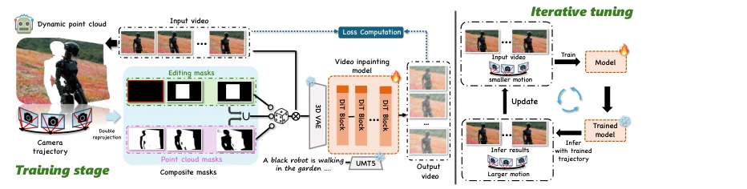

*来源：P08，Fig.2 图区域裁剪。*

### P09｜Follow-Your-Motion：把结构性冲突变成章节骨架

[原文：2506.05207v4](https://arxiv.org/abs/2506.05207v4)

**任务与冲突。** 将参考视频运动迁移到新内容。DiT 的 3D attention 混合时空信息，原有两阶段 LoRA 不易有效分工；处理全部帧也让适配昂贵。

| 核心模块 | 输入 → 输出／机制 | 阶段 | 论证要求 |
|---|---|---|---|
| Head classification | attention head 的空间／时间响应 → 分组与投影重排 | Stage 1 | 先证明头之间存在可利用差异 |
| Spatial LoRA | 单帧训练 → 空间外观适配 | Stage 2 | 单帧数据为什么适合该子任务 |
| Temporal LoRA | 稀疏视频帧 → 运动适配，冻结已适配空间部分 | Stage 3 | 隔离外观与运动的参数职责 |
| Sparse motion sampling | 完整序列 → 稀疏帧子集，例如 81→17 帧 | Stage 3 | 用更少帧维持运动信息 |
| Adaptive RoPE | 稀疏帧与时间位置 → 相适应的位置表示 | Stage 3 | 抽帧改变了时间间隔，不能忽视 |
| Motion loss | 时间差分／余弦关系 → 动态约束 | Stage 3 | 超过逐帧外观重建的运动要求 |

**章节写法。** 摘要先明确 motion inconsistency 和 tuning inefficiency，解释 3D coupling，再逐阶段描述三阶段方法，最后用 MotionBench 承接评价。Introduction 对旧双路适配在新架构上失败作出诊断。Related Work 是 T2V 与 Motion Transfer，后者再区分显式控制、training-free、tuning-based。Method 让阶段顺序成为阅读顺序；Experiments 包括 Implementation、MotionBench、Baselines 和 Ablation。Conclusion 用两种 inefficiency 回收设计。附录中的 head classification、算法与补充消融用于补足操作细节，不能仅看总览图复现。

**图与证据。** p3 Fig.2 先展示 naive leakage 与 head 模式；p5 Fig.3 左上给真实响应和理想化结构的区别，下方给单帧／稀疏视频两路，右侧明确 LoRA 的冻结／更新；p6 Fig.4 解释 RoPE；p9 Table 2／Fig.7 检查核心部件。

**阅读提醒。** 文字公式与算法对相似度的表述需要逐项核对，不能直接照搬一个概括公式。把 head 分组解释为论文中的统计／操作性分组，不能夸大成神经元天然、严格、唯一的物理解耦。

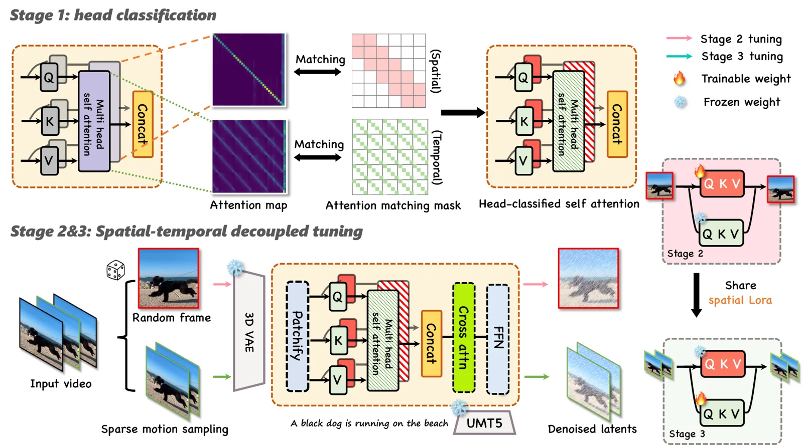

*来源：P09，Fig.3；源码 images/framework0921.pdf。*

### P10｜Emoji-Faster：期刊扩展如何改变整篇的论证重心

[原文：2509.16630v1](https://arxiv.org/abs/2509.16630v1) · [IJCV DOI](https://doi.org/10.1007/s11263-025-02685-z)

**定位。** 这是 Emoji 的扩展，继承 landmarks、facial loss 和 progressive generation，增加加速机制与 EmojiBench++。不能将继承部件再次全部包装成新增贡献。

| 核心模块 | 输入 → 输出／机制 | 在扩展中的角色 |
|---|---|---|
| 原 Emoji 控制与生成组件 | 参考人像／landmarks → 长人像动画 | 保留基础能力与对照起点 |
| Taylor-Interpolated Cache（TIC） | 若干去噪步的特征及有限差分 → 复用或预测后续特征 | 减少重复网络计算 |
| 区域与步段策略 | 背景、landmark 相关区域及去噪时间段 → 不同缓存／近似规则 | 避免同一复用策略损伤关键表情 |
| EmojiBench++ | 更广的参考画像分布，500 张 portraits | 扩展评测覆盖；论文称仅用于评估 |

**章节写法。** 摘要需同时建立原有质量能力和新增效率问题。Related Work 从 Emoji 的两类 portrait animation 扩展出 Acceleration of Diffusion Models，说明新的贡献需要新的比较邻域。Preliminaries 单列；Method 4.1–4.3 保留表示、损失和长期策略，4.4 专门展开缓存。Experiments 单设 EmojiBench++，比较分定性与定量，再做消融；之后独立设置 Application、Discussion、Conclusion。Discussion 承担局限讨论，不应只剩结尾一句“future work”。这种篇幅允许区分基础框架、加速增量和应用。

**图与证据。** p6 Fig.2 在原训练／推理图下增加 TIC 子流程，读者能看到扩展落在哪；§4.4 p7–8 讲机制；p12 Fig.12／Table 4 验证加速，p13 Table 5 扫缓存配置。

**边界。** 文中的 2.6× 与“lossless”应理解为论文设置下报告的加速与评估质量近似保持，不是数学意义的无损。需要注明比较对象、硬件、分辨率、步数和是否包含其他预处理。

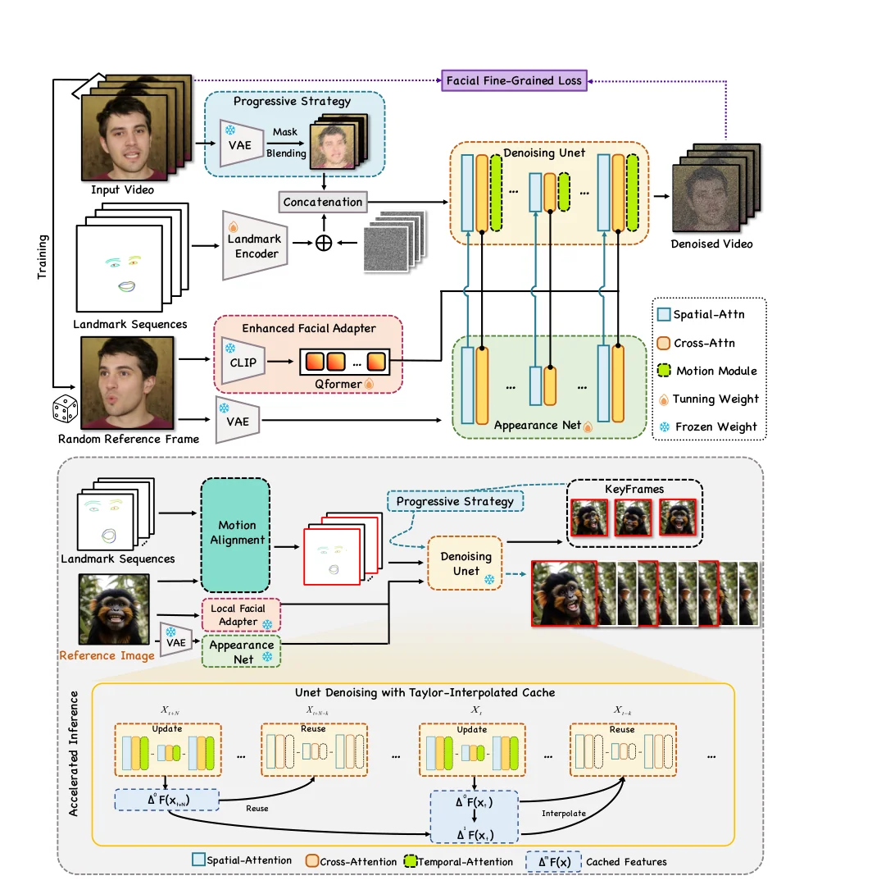

*来源：P10，Fig.2 图区域裁剪；新增缓存流程位于下方。*

### P11｜FastVMT：效率论文必须先把耗时拆开

[原文：2602.05551v3](https://arxiv.org/abs/2602.05551v3)

**任务与冲突。** 不训练模型参数的运动迁移仍会在提取 motion correspondence 和求引导梯度时消耗大量计算。提出局部运动和相邻优化梯度的冗余观察。

| 核心模块 | 输入 → 输出／机制 | 作用与边界 |
|---|---|---|
| Efficient attention window | 代表 query／局部窗口 → 对应运动 embedding | 减少不必要的全局 token 比较；大位移需要考虑窗口限制 |
| Attention motion-field alignment | 源与目标运动表征 → 对齐损失 | 驱动目标 latent 获得参考运动 |
| Corresponding-window loss | 对应窗口的 key 表征 → 一致性约束 | 约束局部对应，补偿粗化搜索 |
| Step-skipping gradient optimization | 已算的优化梯度 → 若干后续内循环更新复用 | 减少反向计算；过度复用会退化 |

**章节写法。** 摘要命名 motion redundancy 与 gradient redundancy，然后各给一种干预。Introduction 先分别交代 training-based 和 training-free 的成本，之后用两条观测引出贡献。Related Work 保留 T2V、Motion Transfer 的基本背景。Method 特别单设 3.1 Motivation，再按 3.2 Window、3.3 Loss、3.4 Gradient Optimization 排列：先让读者相信冗余存在，再读算法。Experiments 在质量之外讨论时间，Ablation 需要同时报告两者。Conclusion 回收两类冗余；附录扩展参数、对应层与局限。

**图文证据。** p3 Fig.2 的局部性与梯度 PCA、p4 Fig.3 的复用过程先解释依据；p5 Fig.4 再给整体架构；p8 Table 1／Fig.7 给比较；p10 Fig.10 给消融。总览图将 inversion 与 denoising 上下排，源／目标特征及损失在中间对齐。

**读写容易混淆的点。** 摘要有较宽泛的 diffusion trajectory 表述，具体操作要以方法中的优化循环为准：此处关注同一去噪时间步内连续优化更新的梯度复用，不能简写成“直接跳过扩散时间步”。training-free 不等于没有推理优化。

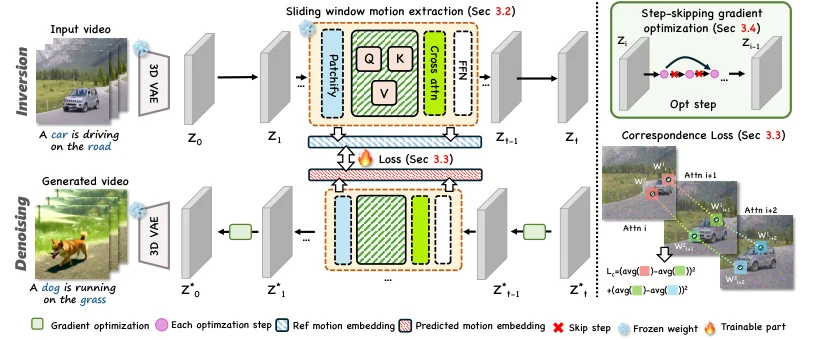

*来源：P11，Fig.4 图区域裁剪。*

### P12｜Group Editing：数据贡献与表示贡献如何分章节

[原文：2603.22883v3](https://arxiv.org/abs/2603.22883v3)

**任务与冲突。** 一组相关图片需要一致编辑，但不同视角、构图和遮挡妨碍直接对齐。将图片组当作伪视频来利用一致性先验，再加入几何与身份位置对齐。

| 核心模块 | 输入 → 输出／机制 | 对应需求 |
|---|---|---|
| GroupEditData 构建 | Gemini 生成组图 → SAM／DINO 等处理与一致性、美学过滤 → Qwen-VL 标注 | 为组图编辑提供训练样本；保留 7,517 组 |
| 视频先验 | 图片组 → 序列模型联合处理 | 利用已有跨帧一致性能力 |
| 显式几何 token | VGGT 特征 → 与 latent tokens 拼接参与 attention，几何输出 token 再丢弃 | 在视角变化下建立对应 |
| Ge-RoPE | 几何差异与置信度 → 位置对齐 | 补充隐式序列先验缺少的几何约束 |
| Identity-RoPE | 对象 mask 的 bbox 局部坐标 → 对齐位置表示 | 让同一主体在不同构图中有可比坐标 |

**章节写法。** Introduction 先定义 Group-Image Editing，强调单图方法和直接视频先验留下的缺口。Related Work 将 image editing 与 video priors 分开；Method 3.1 Data Curation 细分生成、筛选、标注，3.2 Group Editing 再讲 overview、Ge-RoPE、Identity-RoPE。这样数据问题先于模型细节，读者不会误以为数据已天然可得。Experiments 先 Implementation／Applications，再比较和消融；Conclusion 同时回收几何—隐式先验结合与数据集。附录补数据与实现细节，核心过滤准则应能在正文找到概述。

**图与证据。** p3 Fig.2 数据流水线，p4 Fig.3 模型加两种 RoPE 放大图；p5 Algorithm 1／Fig.4 支撑坐标操作；p8 Table 3／Fig.8 做消融。彩色 token 条带画序列组织，右侧几何草图画坐标意义，承担不同解释任务。

**边界。** Identity-RoPE 不是人脸识别 embedding。伪时间不一定有真实时间顺序，需要关注输入排序、遮挡、大视角差异下的表现。

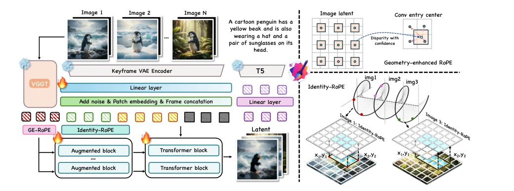

*来源：P12，Fig.3 图区域裁剪。*

### P13｜EasyVFX：从频率观察引出专家与轻量适配

[原文：2605.22051v1](https://arxiv.org/abs/2605.22051v1)

**任务与冲突。** 在有限数据与计算下迁移参考视频的视觉特效，兼顾外观和动态。用频谱能量描述两类信息，并分配适配能力。

| 核心模块 | 输入 → 输出／机制 | 阶段 |
|---|---|---|
| 两种时间归约 | noisy latent 的时间均值描述外观；帧差平方均值取 log 描述动态 | 特征构造 |
| 三频带描述 | Gaussian low-pass／残差等得到各归约的三频带能量；归一化为 6D 描述 | 路由条件 |
| Frequency-aware MoE | 软路由混合 LoRA experts，总 rank 预算受控 | Stage 1 训练 router／experts |
| Test-time adaptation | 冻结骨干和 adapters，优化 VFX conditioning embeddings | Stage 2 参考特效适配 |
| Frequency constraint | 归一化频带能量的 L1 约束 | 避免少量适配偏离目标频率特征 |

**章节写法。** Introduction 通过频率观察连接有限资源与外观／动态学习，先给现象再介绍专家。Related Work 交代 controllable video generation 和特效邻域。Method 分 Preliminaries、Frequency-aware MoE Training、Test-Time Training、Training and Inference Workflow；最后一节专门汇总不同阶段更新谁，避免局部模块说明让读者失去全流程。Experiments 对照预算、质量与适配，消融必须包含路由及 frequency constraint。Conclusion 回收频率分解、专家、轻量适配三个环节。补充页继续给实现和结果。

**图与证据。** p3 Fig.3 频率观察，p4 Fig.4 资源／效果权衡，p5 Fig.5 总览，p8 Table 2／Fig.7–8 消融。总览图按两个横向阶段排，右侧用局部图解释 router／loss。

**边界。** 匹配频谱能量不能保证相同运动轨迹或精确时空位置。所读 v1 有未解析的章节引用，学习时应取其论证结构，提交前自行清理交叉引用。

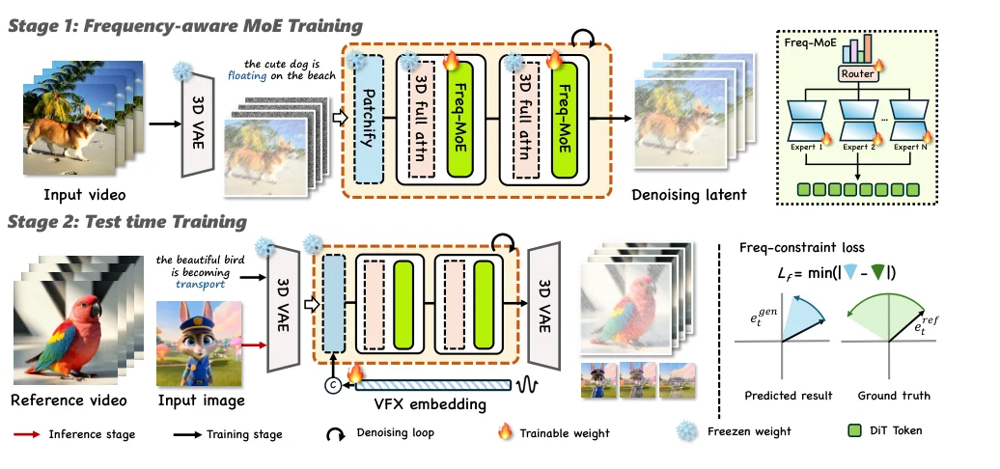

*来源：P13，Fig.5 图区域裁剪。*

### P14｜LiveLight：交互条件如何组织整篇方法

[原文：2608.01771v1](https://arxiv.org/abs/2608.01771v1)

**任务与冲突。** 重打光时允许用户在线改变光照。离线整段生成无法及时响应；少步生成可能损伤结构，流式输出又要维持时间一致性。

| 核心模块 | 输入 → 输出／机制 | 使用位置 |
|---|---|---|
| Relighting data synthesis | 构造重光照训练监督 | 方法先交代数据来源 |
| Multi-Plane Lighting Interactive Control | 光位置、强度、颜色与深度 → 4 个深度平面 × RGB 的 12 通道 irradiance 表示 | 轻量 adapter 注入浅层 attention |
| Few-step training／distillation | 少步 rollout，随机选取的最终更新反传 | 加速生成；论文使用四步设置 |
| Geometry-guided feedback | 冻结深度／法线估计器 → 对生成图像的几何反馈 | 训练使用；不应画成每帧推理必经模块 |
| Rolling-window streaming | 输出最旧 micro-chunk，保留历史 latent，推入新噪声 | 推理连续滚动 |
| 动态条件更新 | 新参考／新光照 → 后续帧生成条件 | 对应用户在线控制 |

**章节写法。** Introduction 把 offline clip-level 与 streaming interaction 的使用差异放在前面，速度由用户操作需求推出。Related Work 分 Relighting、Real-time Video Generation、Controllable Video Generation。Method 3.1 数据 → 3.2 表示 → 3.3 几何约束蒸馏 → 3.4 流式窗口 → 3.5 Objectives，按构建系统所需的依赖顺序写。Experiments 先 Application，随后实现、基线、消融，说明真实操作是主张的一部分。独立 Limitation 在 Conclusion 前，之后有 Potential Societal Impacts。该公开版本将较多消融图表放到后部，阅读时按主张回查，不只顺着前几页看。

**图与证据。** p2 Fig.2 区分离线／流式；p5 Fig.3 三面板依次讲表示、几何反馈和滚动窗口，Fig.4 讲数据；p6 Fig.5 几何曲线；p9 Fig.9 GUI；p12–13 Fig.13–19 和 p14 Tables 4–5 给消融。滚动橙框是时间流程的核心视觉编码。

**边界。** 报告端到端延迟、吞吐、硬件、分辨率与 chunk／window 设置；不能把 FPS 当作完整交互体验。论文也有未解析的 appendix 引用，应在自己的稿件中纠正此类问题。

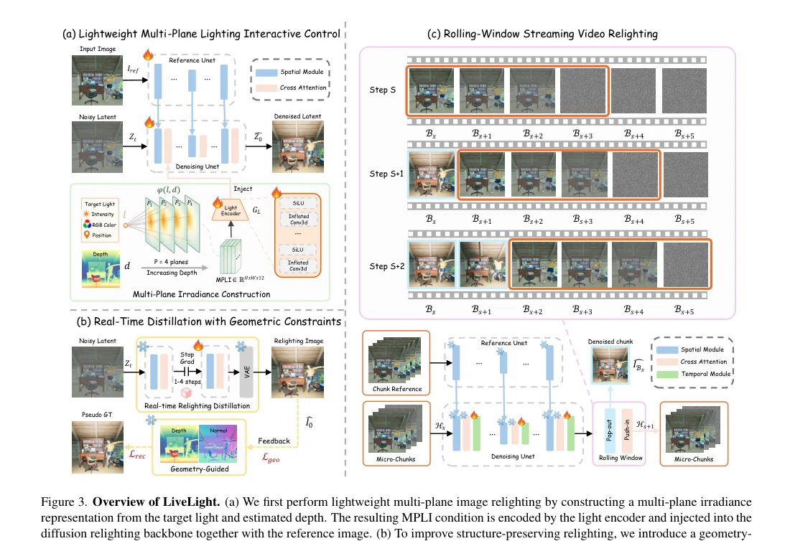

*来源：P14，Fig.3；三面板分别回答控制如何编码、少步质量如何约束、序列如何滚动。*

### P15｜综述：将领域结构转成你的选题地图

[原文：2507.16869v3](https://arxiv.org/abs/2507.16869v3)

它的章节逻辑与方法论文不同：Introduction 定义范围；Preliminaries 建立基础；Method 说明综述组织；Video Generation 交代模型演化；Controllable Video 按 Structure、ID、Image、Temporal、Audio、Other、Universal 七类展开；Application 连接应用；Discussion and Future Work 讨论多条件统一、推理／生成结合以及混合与可扩展方向；Conclusion 收束全景。

**学习段落单位。** 先说明该控制模态表达什么，再分路线、代表方法、局限，最后用小结比较。这比按发表年份连续列论文更方便寻找缺口。p7 Fig.4 将基础、控制模态、任务与应用连接；p8 Fig.5 展示类别交叠。

**使用方式。** 以“控制表示 × 模型先验 × 用户接口 × 成本瓶颈”检索自己的题目，再进入具体论文。分类图中的空格只是检索入口，不自动意味着尚无人研究。

### P16｜AKU：只在证据覆盖范围内学习早期表达

[官方仓库](https://github.com/mayuelala/AKU) · [DOI](https://doi.org/10.1145/3503161.3548257)

Visual Knowledge Graph for Human Action Reasoning in Videos，ACM MM 2022。Crossref 与官方仓库支持 Yue Ma 为首位作者；未获得可读全文，因此不能声称已经拆解其摘要、Introduction 或每个实验模块。

从官方框架图可以确认：左侧是带部位／动作局部标注的视频，中间显式区分身体部位、动作词和物体节点，右侧连接 visual action knowledge 与 semantic action knowledge。图的教学点是**从实例到图结构，再到知识规模与语义**的三级放大。Kinetic-TPS 与 AKU 框架由仓库介绍，具体损失和训练机制本手册不作补全。

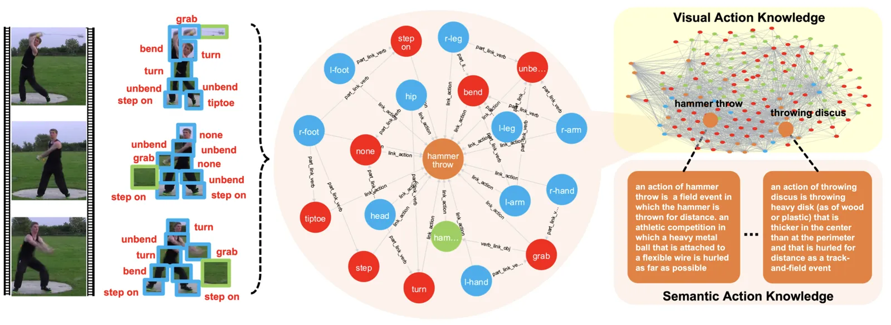

*来源：P16 官方仓库 framework 图，压缩预览；仅作有限范围的视觉分析。*
